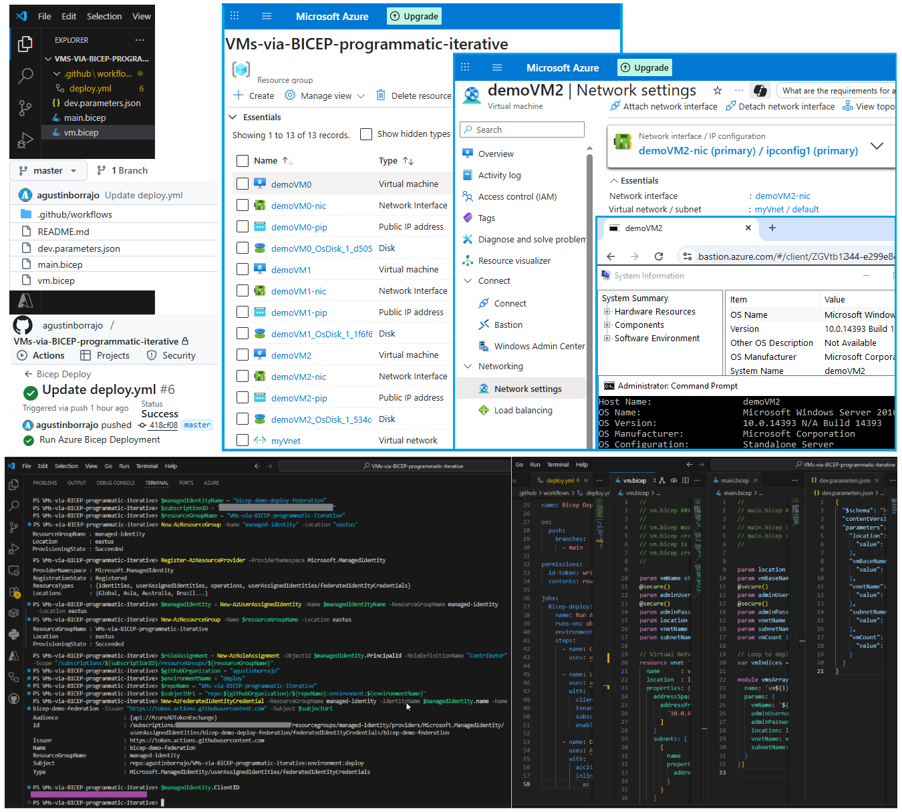

# VMs-via-BICEP-programmatic-iterative
VNET + Subnet + IP Address Space + VM Public IP + NIC + VM

**[📕 cloudconsulting.agustin.50megs.com/azure-vm-bicep-iterative/](http://cloudconsulting.agustin.50megs.com/azure-vm-bicep-iterative/)**

